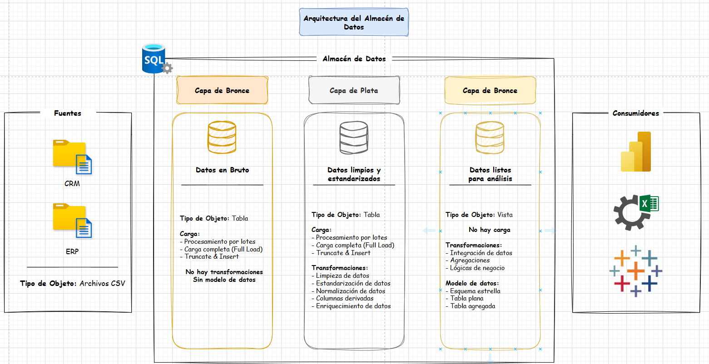
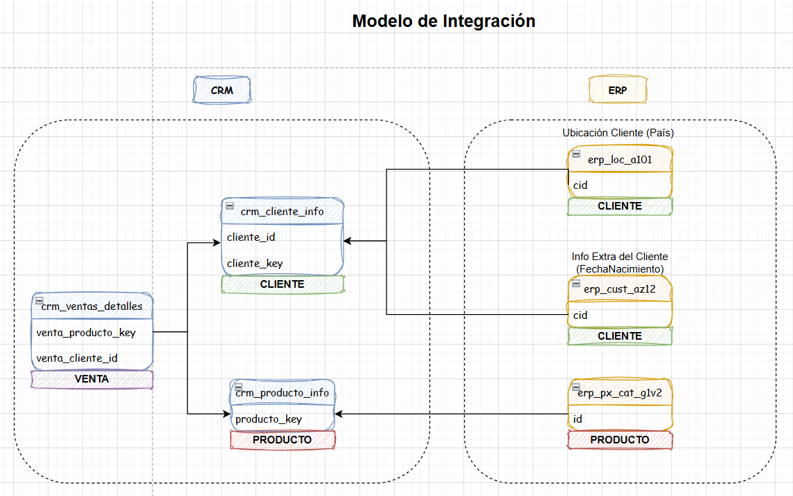
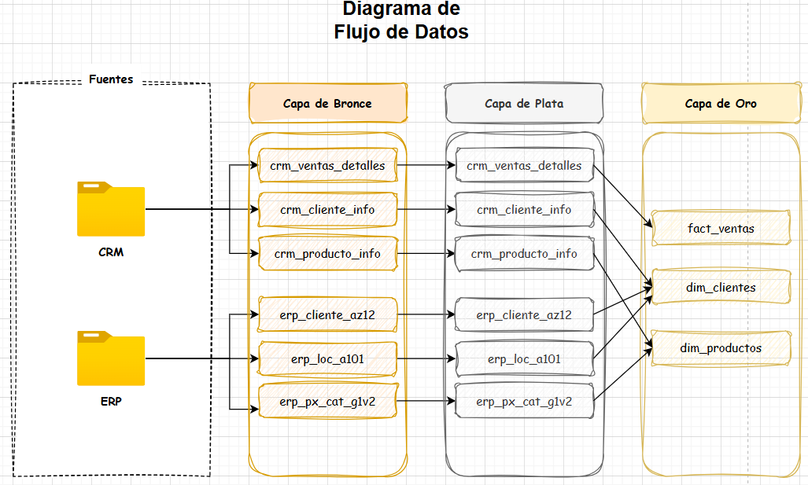
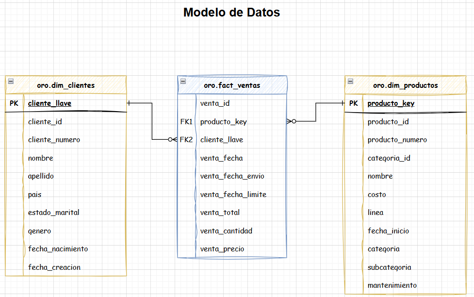
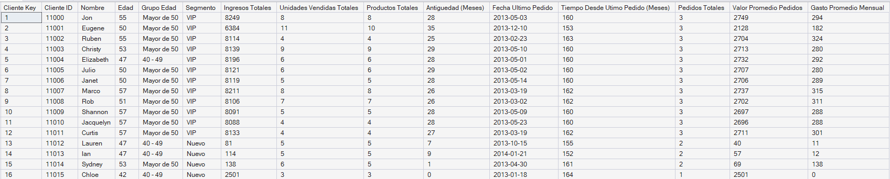
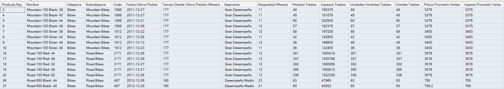

# Proyecto de Data Warehouse y Análisis de Datos - SQL Server

Construyo un almacén de datos a partir de dos fuentes distintas: un sistema ERP y un sistema CRM, con el objetivo de realizar un análisis de los datos y generar insights para una empresa comercializadora de bicicletas y accesorios. Gracias a este proyecto, he podido aplicar lo aprendido en el curso de SQL Server ofrecido por Baraa Khatib Salkini (Data with Baraa) en la plataforma Udemy. Este es un proyecto de portafolio para mis prácticas preprofesionales en Análisis de Datos e Inteligencia Artificial.

# Objetivo

Construir un almacén de datos utilizando la arquitectura Medallion y siguiendo el flujo ETL, con el propósito de generar insights a través del análisis de datos, utilizando las funciones, técnicas y conocimientos aprendidos en el curso de Data with Baraa.

# Arquitectura de Datos

La arquitectura de datos para este proyecto sigue la Arquitectura Medallion, la cual presenta 3 capas: Bronce, Plata y Oro.

1. **Capa de Bronce**: Almacena la data sin procesar de los sistemas fuente. Aquí insertamos la data a la base de datos SQL Server a partir de archivos CSV.

2. **Capa de Plata**: Aquí limpiamos, estandarizamos y normalizamos los datos para preparlos para el análisis correspondiente.

3. **Capa de Oro**: Aquí creamos un esquema estrella y exponemos los datos mediante vistas, de manera que estén listos para el análisis y la generación de reportes.

# Modelo de Integración

Nos permite entender cómo se relacionan las tablas a pesar de pertenecer a diferentes sistemas fuente (ERP y CRM).

# Diagrama de Flujo de Datos

1. La Capa de Bronce extrae los datos crudos de los sistemas fuente (CRM y ERP) para crear las siguientes tablas:

- `crm_ventas_detalles`: Contiene los datos de cada venta, tales como: id, código de producto, código de cliente, fecha, cantidad, precio del producto, total, etc.
- `crm_cliente_info`: Contiene los datos de los clientes del sistema CRM, tales como: id, nombre, apellido, fecha de creacion, etc.
- `crm_producto_info`: Contiene los datos de los productos de la empresa, tales como: id, nombre, costo, linea, etc.
- `erp_cliente_az12`: Contiene los datos de los clientes del sistema ERP, tales como: id, fecha de nacimiento y el género.
- `erp_loc_a101`: Contiene los datos de la ubicación de los clientes, tales como: id, y país.
- `erp_px_cat_g1v2`: Contiene los datos de las categorías de los productos, tales como: id, categoria, subcategoria, etc.

2. La Capa de Plata presenta las mismas tablas de la Capa de Bronce, pero con la diferencia que los datos han sido limpiados, estandarizados y normalizados.

3. La Capa de Oro integra los datos de las tablas de la Capa de Plata para tener los datos listos para el análisis y la generación de reportes. Los datos se integran y exponen en las siguientes vistas:

- `fact_ventas`: Es una tabla de hechos (fact/data table) que consolida la información de las ventas.
- `dim_clientes`: Es una tabla de dimensiones (dimension/lookup table) que consolida la información de los clientes (`crm_cliente_info`, `erp_cliente_az12`, `erp_loc_a101`).
- `dim_productos`: Es una tabla de dimensiones (dimension/lookup table) que consolida la información de los productos (`crm_producto_info`, `erp_px_cat_g1v2`).

# Modelo de Datos

Como podemos ver, la Capa de Oro de nuestro Data Warehouse presenta un esquema estrella, pues está conformado por una fact table (`fact_ventas`) y dimension tables (`dim_clientes` y `dim_productos`).

## Reportes Finales

### Reporte de Clientes

### Reporte de Productos

# Funcionalidades utilizadas

- Carga de datos: `BULK INSERT`, procedimientos almacenados con manejo de errores `TRY...CATCH`.
- Transformación: Funciones de texto (`UPPER`,`TRIM`, `REPLACE`, `SUBSTRING`, `LEN`), funciones de casteo (`CAST`), funciones de fecha (`GETDATE`), funciones ventana (`LEAD`, `ROW_NUMBER`).
- Integración: `LEFT JOIN` para unir tablas tanto en la capa de oro como para el análisis de datos.
- Validación de calidad de datos: En la capa de plata usé subqueries para detectar duplicados e inconsistencias.
- Exposición de la Capa de Oro: Utilicé vistas `CREATE VIEW AS` para exponer los datos de las tablas de mi esquema estrella, de manera que estén listos para ser consumidas por analistas y demás usuarios.
- Análisis avanzado: Usé CTEs para crear consultas de múltiples pasos y crear los reportes finales de clientes y productos. Asimismo, utilicé funciones de agregación (`COUNT`, `SUM`, `MIN`, `MAX`) y funciones de fecha (`EOMONTH`, `DATEDIFF`).
- Segmentación de datos: Usé `CASE WHEN` para clasificar clientes y productos en categorías. Por ejemplo clasifiqué a los clientes por grupos edad y comportamiento de compras (VIP, Regular, Nuevo), y a los productos por los ingresos generados (Gran desempeño, desempeño medio, desempeño bajo).

## Hallazgos generados

- Entre Diciembre de 2010 y Enero de 2014, los ingresos acumulados fueron de S/ 29.35 millones.
- Entre Diciembre de 2013 y Enero de 2014, la cantidad de clientes disminuyó en un 39% aprox. (2133 a 834).
- La categoría de productos que genera más ingresos es la de Bicicletas, con un aporte del 96.46%.
- Tras segmentar a los productos en rangos de costo, podemos decir que: 110 productos cuestan menos de S/ 100 y 39 productos cuestan más de S/ 1000.
- Tras segmentar a los clientes según la antiguedad de su historial de compras y el dinero generado para la empresa por sus compras, podemos decir que: más de 14 mil clientes son considerados `Nuevos`, más de 2100 son considerados `Regulares` y 1655 `VIP`.

## Autor

**Luis Tomás Dávila Naveda**
Estudiante de Ingeniería de Sistemas de Información — USIL

- Email: tonadavnav05@gmail.com
- LinkedIn: [linkedin.com/in/tomasdavilanaveda](https://www.linkedin.com/in/tomasdavilanaveda)

## Licencia

Este proyecto está bajo la licencia MIT.
